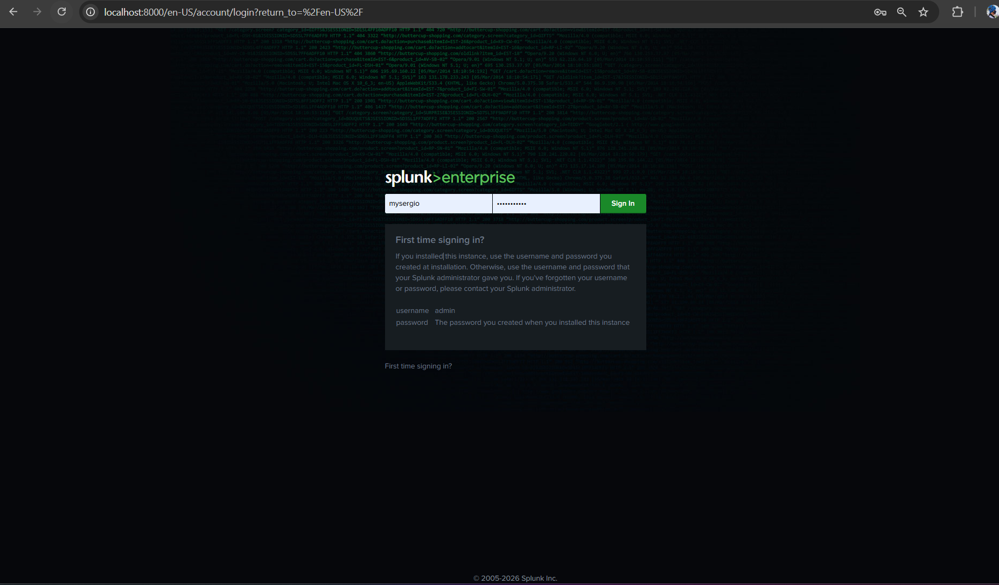

# Real-Time Network Threat Detection Using SIEM

Hey! I am Umar — B.Tech CS/IT student from Quest 
Group of Institutions. I am currently 
learning SOC Analysis and this is my hands-on 
project where I actually did everything myself 
on my own laptop. 

## What I Built
A mini SOC lab where I used Parrot OS to attack 
my own Windows machine and then Detect those 
attacks live in Splunk.

## My Lab Setup
- Windows 11 — my main laptop (victim + Splunk)
- Parrot OS — running in VirtualBox (attacker)
- Splunk Enterprise 10.2.1 — SIEM tool

## What I Did

**Step 1 — Setup**
I Installed VirtualBox, set up Parrot OS inside it,
then installed Splunk on Windows and connected 
Windows Event Logs to it. Within few hours I was 
already seeing 42,000+ real events in Splunk.

**Step 2 — Attack**
From Parrot OS I ran Nmap to scan open ports on 
my Windows machine. Then I wrote a Python script 
to perform brute force attack — trying multiple 
wrong passwords repeatedly.

**Step 3 — Detection**
Splunk capture everything. EventCode 4625 showed 
all the failed login attempts. I built a custom 
dashboard to visualize the attacks and set up 
a real-time alert that fires automatically when 
brute force is detected.

## Results
Port Scanning using Nmap — Not Detected.
Brute Force using Python — Detected  (MITRE T1110).
Failed Logins via SMBclient — Detected  (MITRE T1078).

## Folder Structure
- screenshots/ — everything I did, step by step.
- scripts/ — my Python brute force script.

## Honest Thoughts
This project was not easy for me at all 
ping was not connecting, Hydra keep failing 
and Splunk alerts was not showing anywhere.

Took me while to figure out that firewall 
was blocking ping so i just turned off firewall.
Hydra never worked on Windows SMB 
so i just wrote Python script 
instead.One more thing correct filter is also 
important to get what logs you want.

If you learning SOC then just build something 
like this. Theory is good but when real thing 
breaks and you fix it.You will learn in 2 days more than months of theory.

##Screenshots

