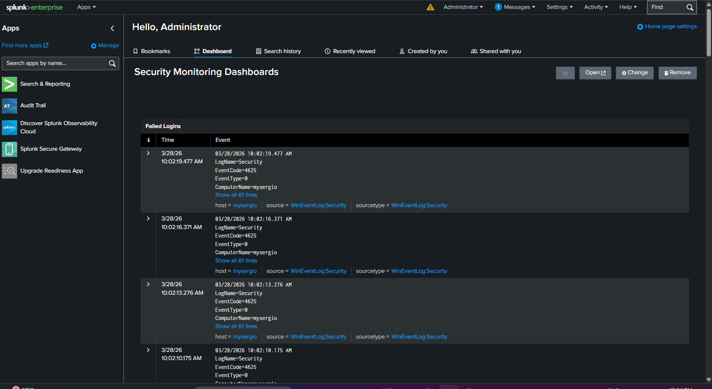
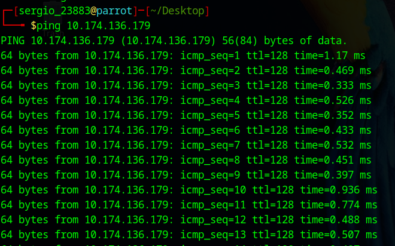
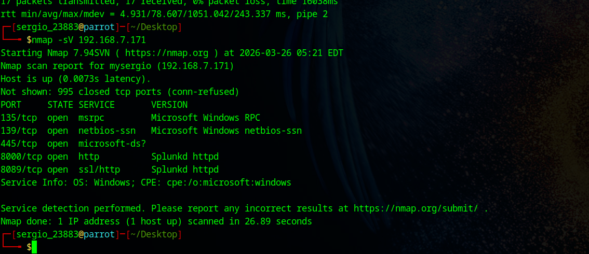
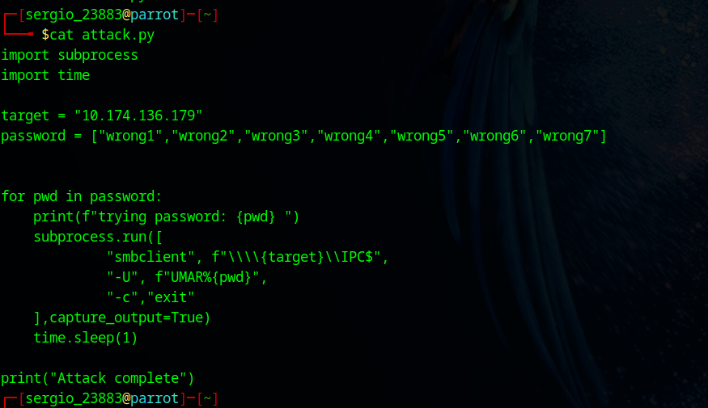
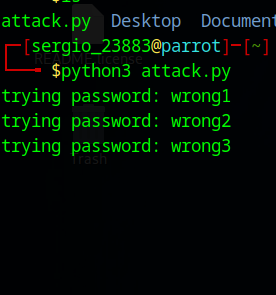
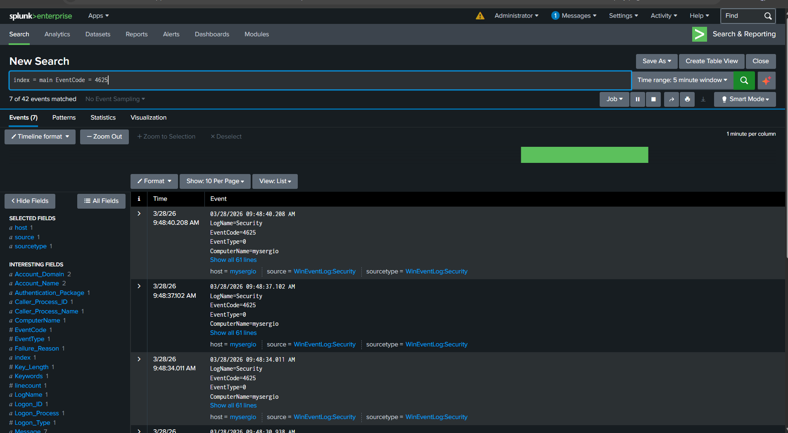
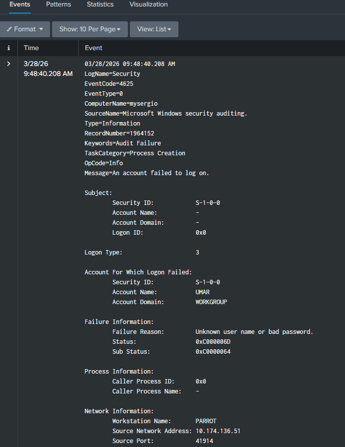
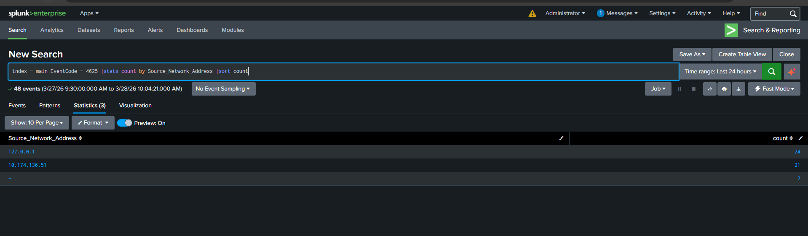
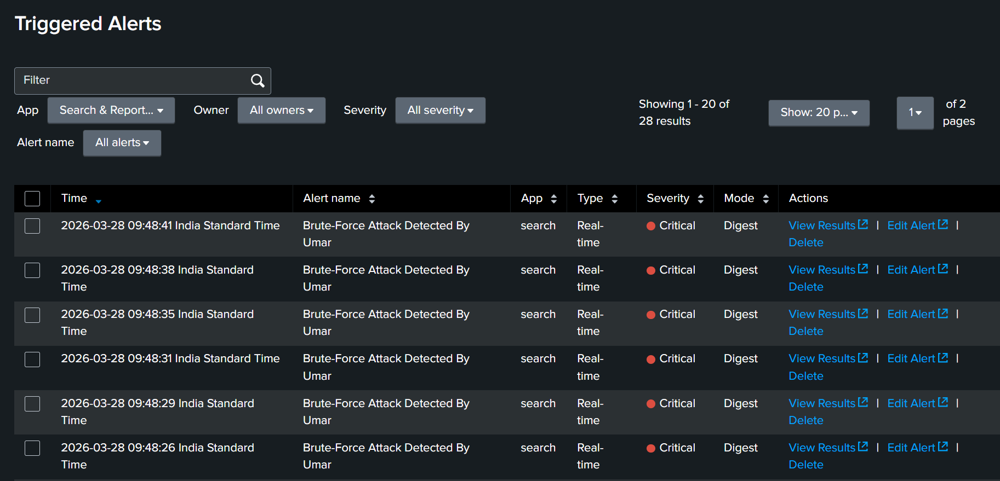

# Real-Time Network Threat Detection Using SIEM

Hey! I am Umar — B.Tech CS/IT student from Quest Group of Institutions. I am currently learning SOC Analysis and this is my hands-on project where I actually did everything myself on my own laptop.


## What I Built

A mini SOC lab where I used Parrot OS to attack my own Windows machine and then Detect those attacks live in Splunk.


## My Lab Setup

* Windows 11 — my main laptop (victim + Splunk)
* Parrot OS — running in VirtualBox (attacker)
* Splunk Enterprise 10.2.1 — SIEM tool


## What I Did

### Step 1 — Setup

I Installed VirtualBox, set up Parrot OS inside it, then installed Splunk on Windows and connected Windows Event Logs to it. Within few hours I was already seeing 42,000+ real events in Splunk.

These are the main EventCodes I was collecting:

#### EventCode - What it means 
 4624 = Successful login.
 4625 = Failed login attempt. 
 4648 = Login with explicit credentials. 
 4720 = New user account created. 
 7045 = New service installed .

### Step 2 — Attack

From Parrot OS I ran Nmap to scan open ports on my Windows machine:

```bash
nmap -sV -192.168.7.171
```

Then I tried Hydra for brute force but it kept giving this error every single time:

```
[-] invalid reply from target smb://10.174.136.179
```

Hydra never worked on Windows SMB so i just wrote Python script instead:

```python
import subprocess
import time

target = "10. 174. 136. 179"
password = ["wrong1","wrong2","wrong3","wrong4","wrong5","wrong6","wrong7"]

for pwd in password:
print ( f"trying password: {pwd} ")
subprocess . run ( [
"smbclient", f"\\\\{target}\\IPC$",
"-U", f"UMAR%{pwd}"

"-c","exit"
],capture_output=True)
time.sleep(1)
```

Every wrong password attempt this script makes shows up as EventCode 4625 in Windows logs which Splunk picks up in real time.

### Step 3 — Detection

Splunk capture everything. EventCode 4625 showed all the failed login attempts. I built a custom dashboard to visualize the attacks and set up a real-time alert that fires automatically when brute force is detected.

This is the actual SPL query I used to detect brute force:

```splunk
index=windows EventCode=4625
| stats count by Source_Network_Address
| where sount > 5
```

I set threshold at 5 because when testing I noticed my own normal wrong passwords never went above 2 in a row. So anything above 5 from same IP means something automated is running, not a real person mistyping.

For the real-time alert I used this with a 5 minute window:

```splunk
index=windows EventCode=4625
| stats count by Source_Network_Address
| where count > 10
```

Alert fires automatically when any single IP crosses 10 failed logins in 5 minutes.


## Results

- Nmap SYN Scan — NOT Detected (T1046) — no alert.
- Brute Force using Python — DETECTED (T1110) — EventCode 4625 — alert fired.
- Failed Logins via SMBclient — DETECTED (T1078) — EventCode 4625 LogonType=3 — alert fired.

**Actual numbers from Splunk during brute force run:**
- Total 4625 events generated: 21.
- Time window: around 10 minutes.
- Alert fired: roughly 90 seconds after attack started.
- Rate: around less than 1 failed attempts per second.

**Why Nmap was not detected:**

Windows Event Logs only record authentication events — logins, failures, account changes. Nmap SYN scan never completes a full TCP handshake so Windows never logs it at all. No event gets created, so Splunk has nothing to pick up.

To detect port scanning I would need Sysmon installed (EventCode 3 captures every network connection at OS level) or Windows Firewall logging enabled so dropped packets get recorded. That is my next step for this lab.


## Honest Thoughts

This project was not easy for me at all ping was not connecting, Hydra keep failing and Splunk alerts was not showing anywhere.

Took me while to figure out that firewall was blocking ping so i just turned off firewall. Hydra never worked on Windows SMB so i just wrote Python script instead.

Splunk alerts were firing but I couldn't find them — turns out they go to Activity > Triggered Alerts, not the main dashboard. Had to add them manually after figuring that out.

Also when I first opened Splunk I had 42,000 events with no idea what I was looking at. Learning to filter properly was actually one of the most useful things from this whole project. Without correct filter you are just drowning in noise.

One more thing correct filter is also important to get what logs you want.

If you learning SOC then just build something like this. Theory is good but when real thing breaks and you fix it. You will learn in 2 days more than months of theory.


##Screenshots










